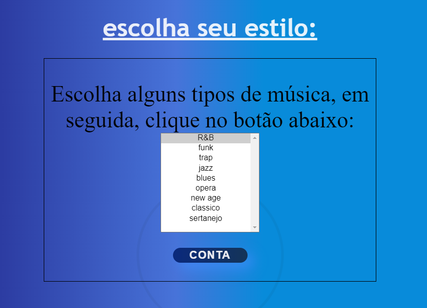

## ♾️Índice
[Projeto - Música](#projeto---m%C3%BAsica-)  
[Descrição](#descri%C3%A7%C3%A3o)  
[Funcionalidades](#funcionalidades)  
[Tecnologias Utilizadas](#tecnologias-utilizadas)  
[Fontes consultadas](#fontes-consultadas)  
[Autores](#%EF%B8%8Fautores)

## 📁Projeto - Música 🎵

## 📝Descrição
⚠️Gêneros Musicais⚠️  
O site é para você selecionar mais de um tipo de genêro musical e mostrar a quantidade selecionada, tudo isso usando JavaScript para treinar laço de repetição for.

## 🔧Funcionalidades
📌O site tem alguns tipos de Gêneros e você ira selecionar um deles ou mais de um.  
📌Quando já tiver selecionado os gêneros musicais de sua escolha, ao pressionar o botão "quantos foram selecionados?"  
📌Nisso irá aparecer uma janela com a mensagem indicando quando você selecionou. Foi utilizado a função **Alert** da linguagem **Javascript**.  

### 💻Tecnologias Utilizadas
🔸JavaScript  
🔸HTML5  
🔸CSS3  

## 📃Fontes consultadas  
🔻https://gist.github.com/lohhans/f8da0b147550df3f96914d3797e9fb89

## ✒️Autores  

🤍[Maria Fernanda](https://github.com/MaferCastilho) 
💗[Iris](https://github.com/iriscarolina)  
❤️Bryan
🖤Janaina